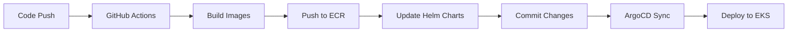

# Retail Store Sample App - GitOps with Amazon EKS Auto Mode


<div align="center">

[](Stars)


<strong>
<h2>AWS Containers Retail Sample - GitOps Edition</h2>
</strong>

**Modern microservices architecture deployed on AWS EKS using GitOps principles with automated CI/CD pipeline**

</div>

## Table of Contents

- [Quick Start](#-quick-start)
- [️ Architecture](#️-architecture)
- [Prerequisites](#-prerequisites)
- [Installation](#-installation)
- [Deployment](#-deployment)
- [GitOps Workflow](#-gitops-workflow)
- [Monitoring](#-monitoring)
- [Troubleshooting](#-troubleshooting)
- [Cleanup](#-cleanup)
- [Advanced Topics](#-advanced-topics)

## Quick Start

**Deploy the complete retail store application!**

- **UI Service**: Java-based frontend
- **Catalog Service**: Go-based product catalog API
- **Cart Service**: Java-based shopping cart API
- **Orders Service**: Java-based order management API
- **Checkout Service**: Node.js-based checkout orchestration API

---

## Architecture

### **Application Architecture**

The retail store consists of 5 microservices working together:

| Service      | Language           | Purpose                | Port |
| ------------ | ------------------ | ---------------------- | ---- |
| **UI**       | Java (Spring Boot) | Web interface          | 8080 |
| **Catalog**  | Go                 | Product catalog API    | 8081 |
| **Cart**     | Java (Spring Boot) | Shopping cart API      | 8082 |
| **Orders**   | Java (Spring Boot) | Order management API   | 8083 |
| **Checkout** | Node.js (NestJS)   | Checkout orchestration | 8084 |


### **Infrastructure Architecture**


**🎯 What you get:**

- **Purpose**: Full production workflow with CI/CD pipeline
- **Images**: Private ECR (auto-updated with commit hashes)
- **Deployment**: Automated via GitHub Actions
- **Updates**: Automatic on code changes
- **Best for**: Production environments, automated workflows, enterprise deployments

### **GitOps Workflow**



---

## Prerequisites

1. **Install Prerequisites**: AWS CLI, Terraform, kubectl, Docker, Helm
2. **Configure AWS**: `aws configure` with appropriate credentials
3. **Clone Repository**: `git clone https://github.com/LondheShubham153/retail-store-sample-app.git`
4. **Deploy Infrastructure**: Run Terraform in two phases (see [Getting Started](#getting-started))
5. **Access Application**: Get load balancer URL and browse the retail store

### **Required Tools**

| Tool          | Version | Installation                                                                         |
| ------------- | ------- | ------------------------------------------------------------------------------------ |
| **AWS CLI**   | v2+     | [Install Guide](https://docs.aws.amazon.com/cli/latest/userguide/install-cliv2.html) |
| **Terraform** | 1.0+    | [Install Guide](https://developer.hashicorp.com/terraform/install)                   |
| **kubectl**   | 1.33+   | [Install Guide](https://kubernetes.io/docs/tasks/tools/)                             |
| **Docker**    | 20.0+   | [Install Guide](https://docs.docker.com/get-docker/)                                 |
| **Helm**      | 3.0+    | [Install Guide](https://helm.sh/docs/intro/install/)                                 |
| **Git**       | 2.0+    | [Install Guide](https://git-scm.com/downloads)                                       |

### **Quick Installation Scripts**

<details>
<summary><strong>🔧 One-Click Installation (Linux/macOS)</strong></summary>

```bash
#!/bin/bash
# Install all prerequisites

# AWS CLI
curl "https://awscli.amazonaws.com/awscli-exe-linux-x86_64.zip" -o "awscliv2.zip"
unzip awscliv2.zip
sudo ./aws/install

# Terraform
curl -fsSL https://apt.releases.hashicorp.com/gpg | sudo apt-key add -
sudo apt-add-repository "deb [arch=amd64] https://apt.releases.hashicorp.com $(lsb_release -cs) main"
sudo apt-get update && sudo apt-get install terraform

# kubectl
curl -LO "https://dl.k8s.io/release/v1.33.3/bin/linux/amd64/kubectl"
chmod +x kubectl
sudo mv kubectl /usr/local/bin/

# Docker
curl -fsSL https://get.docker.com -o get-docker.sh
sudo sh get-docker.sh

# Helm
curl https://raw.githubusercontent.com/helm/helm/main/scripts/get-helm-3 | bash

# Verify installations
aws --version
terraform --version
kubectl version --client
docker --version
helm version
```

</details>

### **AWS Account Requirements**

- **AWS Account** with appropriate permissions

---

## 🔧 Installation

### **Step 1: Clone Repository**

```bash
git clone https://github.com/LondheShubham153/retail-store-sample-app.git
cd retail-store-sample-app
git checkout gitops
```

### **Step 2: Configure AWS**

```bash
# Configure AWS CLI
aws configure

# Verify configuration
aws sts get-caller-identity
aws eks list-clusters --region us-west-2
```

### **Step 3: Setup GitHub Secrets (Required for GitOps)**

Go to your GitHub repository → **Settings** → **Secrets and variables** → **Actions**

Add these secrets:

| Secret Name             | Description    | Example        |
| ----------------------- | -------------- | -------------- |
| `AWS_ACCESS_KEY_ID`     | AWS Access Key | `AKIA...`      |
| `AWS_SECRET_ACCESS_KEY` | AWS Secret Key | `wJalrXUt...`  |
| `AWS_REGION`            | AWS Region     | `us-west-2`    |
| `AWS_ACCOUNT_ID`        | AWS Account ID | `123456789012` |

---

## Deployment

### **Phase 1: Infrastructure Deployment**

```bash
cd terraform/
```

```sh
# Initialize Terraform
terraform init
```


```sh
# Deploy EKS cluster and VPC
terraform apply -target=module.retail_app_eks -target=module.vpc --auto-approve
```

**⏱️ Expected time: 15-20 minutes**

This creates:

- ✅ VPC with public/private subnets
- ✅ EKS cluster with Auto Mode
- ✅ Security groups and IAM roles

### **Phase 2: Configure kubectl**

```bash
# Get cluster name (with random suffix)
terraform output cluster_name

# Update kubeconfig
aws eks update-kubeconfig --region us-west-2 --name $(terraform output -raw cluster_name)

# Verify connection
kubectl get nodes
```

### **Phase 3: Deploy Applications**

```bash
# Deploy ArgoCD and add-ons
terraform apply --auto-approve
```

**⏱️ Expected time: 05-10 minutes**

This deploys:

- ✅ ArgoCD for GitOps
- ✅ NGINX Ingress Controller
- ✅ Cert Manager for SSL
- ✅ ArgoCD applications

### **Phase 4: Access Application**

```bash
# Get load balancer URL
kubectl get svc -n ingress-nginx
```

**🌐 Open the URL in your browser to access the retail store!**


---

## GitOps Workflow

### **How It Works**

1. **Code Push** → Changes to `src/` directory
2. **GitHub Actions** → Detects changed services
3. **Build & Push** → Creates Docker images in ECR
4. **Update Charts** → Modifies Helm chart values
5. **ArgoCD Sync** → Automatically deploys to EKS


### **Making Changes**

```bash
# 1. Make changes to any service
vim src/ui/src/main/resources/templates/fragments/bare.html

# 2. Commit and push
git add .
git commit -m "Add new feature to UI"
git push origin gitops

# 3. Monitor deployment
# - Check GitHub Actions: https://github.com/LondheShubham153/actions
# - Check ArgoCD UI: https://localhost:9090
```

The workflow automatically detects which services changed:

### **Component Details**

| Component                   | Language | Container Image                                                             | Helm Chart                              | Description                             |
| --------------------------- | -------- | --------------------------------------------------------------------------- | --------------------------------------- | --------------------------------------- |
| [UI](./src/ui/)             | Java     | [ Link](https://gallery.ecr.aws/aws-containers/retail-store-sample-ui)      | [ Chart](src/ui/chart/values.yaml)      | Store user interface                    |
| [Catalog](./src/catalog/)   | Go       | [ Link](https://gallery.ecr.aws/aws-containers/retail-store-sample-catalog) | [ Chart](src/catalog/chart/values.yaml) | Product catalog API                     |
| [Cart](./src/cart/)         | Java     | [Link](https://gallery.ecr.aws/aws-containers/retail-store-sample-cart)     | [Chart](src/cart/chart/values.yaml)      | User shopping carts API                 |
| [Orders](./src/orders/)     | Java     | [Link](https://gallery.ecr.aws/aws-containers/retail-store-sample-orders)   | [Chart](src/orders/chart/values.yaml)    | User orders API                         |
| [Checkout](./src/checkout/) | Node.js  | [Link](https://gallery.ecr.aws/aws-containers/retail-store-sample-checkout) | [Chart](src/checkout/chart/values.yaml)  | API to orchestrate the checkout process |

---

## Monitoring

### **ArgoCD Dashboard**

```bash
# Get ArgoCD admin password
kubectl -n argocd get secret argocd-initial-admin-secret -o jsonpath='{.data.password}' | base64 -d

# Port-forward to ArgoCD UI
kubectl port-forward svc/argocd-server -n argocd 9090:443 &

# Access: https://localhost:9090
# Username: admin
# Password: (from above command)
```


### **Application Status**

```bash
# Check all applications
kubectl get applications -n argocd

# Check application health
kubectl describe application retail-store-ui -n argocd

# Check pods
kubectl get pods -n retail-store

# Check services
kubectl get svc -n retail-store

# Check ingress
kubectl get ingress -n retail-store
```

## 🔧 Troubleshooting

### **Useful Commands**

```bash
# Get cluster info
kubectl cluster-info

# Check nodes
kubectl get nodes

# Check all namespaces
kubectl get pods -A

# Check logs
kubectl logs -n retail-store deployment/ui

# Check events
kubectl get events -n retail-store
```

---

### **Debug Commands**

```bash
# Check all resources
kubectl get all -A

# Check events across all namespaces
kubectl get events --sort-by='.lastTimestamp'

# Check ArgoCD logs
kubectl logs -n argocd deployment/argocd-server
kubectl logs -n argocd deployment/argocd-application-controller

# Check ingress controller logs
kubectl logs -n ingress-nginx deployment/ingress-nginx-controller

# Check application logs
kubectl logs -n retail-store deployment/ui
kubectl logs -n retail-store deployment/catalog
```

---

## Advanced Topics

### **Customization**

<details>
<summary><strong>🔧 Enable Monitoring</strong></summary>

```bash
# Edit terraform/addons.tf
enable_kube_prometheus_stack = true

# Apply changes
terraform apply --auto-approve

# Access Grafana
kubectl port-forward svc/kube-prometheus-stack-grafana -n monitoring 3000:80
```

</details>

---

## Cleanup

### **Destroy Infrastructure**

```bash
cd terraform/

# Option 1: Destroy everything at once
terraform destroy --auto-approve

# Option 2: Destroy in phases (recommended)
terraform destroy -target=module.eks_addons --auto-approve
terraform destroy -target=module.retail_app_eks --auto-approve
terraform destroy --auto-approve
```


### **Clean Up ECR Repositories**

```bash
# Delete ECR repositories (manual step)
aws ecr delete-repository --repository-name retail-store-ui --force
aws ecr delete-repository --repository-name retail-store-catalog --force
aws ecr delete-repository --repository-name retail-store-cart --force
aws ecr delete-repository --repository-name retail-store-checkout --force
aws ecr delete-repository --repository-name retail-store-orders --force
```

### **Remove GitHub Secrets**

1. Go to GitHub repository → **Settings** → **Secrets and variables** → **Actions**
2. Delete all AWS-related secrets

---

## 🤝 Contributing

1. Fork the repository
2. Create a feature branch (`git checkout -b feature/amazing-feature`)
3. Commit your changes (`git commit -m 'Add amazing feature'`)
4. Push to the branch (`git push origin feature/amazing-feature`)
5. Open a Pull Request

---

## License

This project is licensed under the Apache License 2.0 - see the [LICENSE](./LICENSE) file for details.

---

## 🙏 Acknowledgments

- **AWS Containers Team** for the original sample application
- **ArgoCD Community** for the excellent GitOps tooling
- **Terraform Community** for the AWS modules
- **GitHub Actions** for the CI/CD platform

---

## Support

- **Issues**: [GitHub Issues](https://github.com/LondheShubham153/retail-store-sample-app/issues)
- **Discord**: [TrainWithShubhamCommunity](https://discord.gg/kGEr9mR5gT)

---

<div align="center">

**⭐ Star this repository if you found it helpful!**

**🔄 For advanced GitOps workflows, see [BRANCHING_STRATEGY.md](./BRANCHING_STRATEGY.md)**

</div>
